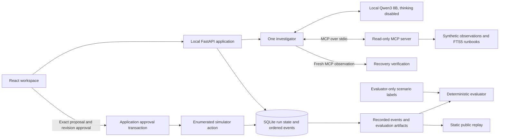

# Incident Lab

An experimental agent that investigates synthetic software incidents, proposes recovery, waits for approval, and checks fresh simulator observations. Built by Jeremy Cleland.

**[Public demo](https://jeremy-incident-lab.netlify.app):** recorded local-model runs only. **Local mode:** genuine Ollama inference and MCP tool calls. No production systems or paid inference APIs are connected.

The interface shows evidence, decisions, approvals, and observed results. It does not expose raw model reasoning. Every downloadable recording identifies its mode, model digest, inference settings, scenario version, and approval actor.

## Try it locally

Prerequisites: Python 3.12 via [uv](https://docs.astral.sh/uv/), Node.js 22/npm, and [Ollama](https://ollama.com/). The model download is approximately 5.2 GB; runtime memory requirements are higher.

```sh
uv sync --frozen
npm ci --prefix web
ollama pull qwen3:8b
# Start Ollama if it is not already running: ollama serve
INCIDENT_LIVE=1 uv run uvicorn incident_lab.api:app --host 127.0.0.1 --port 8787
# In a second terminal:
npm run dev --prefix web
```

Open http://127.0.0.1:5173 and select **Use local agent**. Choose a development incident, inspect its tool results, and approve or reject the proposal. Approval executes only an enumerated simulator action. Cancel is available while a run is active. Public builds have no live inference service; the local button appears only on localhost. Never expose the API or Ollama port to the internet.

For replay alone, run only the frontend. Committed recordings and reports are under `web/public/data/`. The development server does not require Ollama for playback.

## What is simulated

| Incident | Investigation | Recovery action | Result |
| --- | --- | --- | --- |
| Bad API deployment | Error spike, stack trace, release history | Restore release 2026.09.1 | Healthy simulator |
| Connection exhaustion | Pool saturation, concurrency change | Restore worker concurrency to 8 | Healthy simulator |
| Upstream outage | Provider errors, local resources, history | Queue shipping in predefined degraded mode | Degraded; provider remains down |

All logs, metrics, runbooks, deployments, and outcomes are synthetic. The simulator models prescribed action effects; it does not start or repair actual services. Cases with insufficient evidence should produce an explicit abstention.

## Architecture



The model sees only the brief and requested observations. Ground-truth labels and expected actions are never placed in its messages or MCP results. The simulator and evaluator necessarily access ground truth outside the model context.

Tools: `get_service_health`, `query_logs`, `query_metrics`, `list_changes`, `search_runbooks`. The application starts a real official-MCP-SDK client/server session over stdio, scoped to one run. Retrieval uses SQLite FTS5 and stable passage IDs. Recovery is not an MCP tool.

State: `created → investigating → awaiting_approval → executing → verifying → completed`, with rejected, failed, cancelled, and inconclusive terminal states. The executing event and simulator update are one atomic SQLite transaction; the externally visible persisted state advances to verifying. Approval matches run, proposal ID, and simulator revision. A unique approval record and serialized transaction prevent duplicate execution. Restart marks interrupted active work inconclusive and preserves waiting proposals.

Budget: at most eight model responses (six reserved for investigation), twelve tool attempts including verification, one retry per failed read, and five minutes of active execution excluding human approval time. Tool arguments and final proposal output are validated. Recovery status comes from a fresh MCP observation; the model supplies a concise explanation, not the authoritative status.

## Evaluation

See [the evaluation protocol](docs/EVALUATION.md) and downloadable results in `artifacts/`. There are 30 versioned cases: 12 development and 18 held-out, balanced across three incident families. Version 1.1 was frozen before held-out runs.

```sh
uv run python scripts/run_evaluation.py --split development
uv run python scripts/run_evaluation.py --split held_out --repeats 3
uv run python scripts/run_evaluation.py --split held_out --repeats 3 --baseline
uv run python scripts/record_rejections.py
uv run python scripts/export_replays.py
```

The harness explicitly approves proposals to measure recovery; exports label it as **evaluation harness**, not a human operator. Rejection recordings identify their separate recording harness. No scripted provider is used for public inference recordings. Scripted providers appear only in unit/integration tests.

Results must not be read as evidence of production incident response. Cases share templates; rubric-based evidence support is limited; fixed-packet baselines may perform as well as the investigator in this small environment. All misses remain published. The 80% diagnosis/action target is a release target, not an assumption.

## Verification

```sh
uv run pytest -q
uv run ruff check --select F,I incident_lab scripts tests
uv run ruff format --check incident_lab scripts tests
npm run build --prefix web
git diff --check
```

Tests cover the simulator, approval races and rejection, stale/cross-run requests, tool scoping, retry limits, cancellation, timeouts, unavailable Ollama, restart, ordered SSE reconnection, and the investigation/approval/verification path over real MCP. See `docs/ACCEPTANCE.md` for browser and release checks.

## Project layout

- `incident_lab/`: local agent, provider interface, API, MCP server, simulator, store, evaluator.
- `cases/`: frozen synthetic fixtures, checksums, and version history.
- `scripts/`: evaluation, rejection recording, and static export.
- `web/`: accessible operational workspace and public replay viewer.
- `artifacts/`: measured results and genuine run exports.
- `docs/`: evaluation protocol, acceptance evidence, and interview walkthrough.

The provider protocol allows a later adapter; no paid provider is implemented. No uploads, arbitrary commands, arbitrary URLs, credentials, or production integrations are accepted.

## Static deployment

`netlify.toml` builds only the Vite frontend. Deploy `web/dist/` to a separate site. The Python backend, SQLite databases, and Ollama remain local. HTTP security headers prevent public builds connecting to localhost. The public site is an experimental portfolio demonstration.

## Attribution

Code: MIT. Fraunces and IBM Plex Sans fonts: SIL Open Font License, included under `web/public/fonts/licenses/`. Qwen3 is downloaded separately through Ollama; its model license and digest are independent of this repository. The interface adapts Jeremy's portfolio green/cream visual direction.
